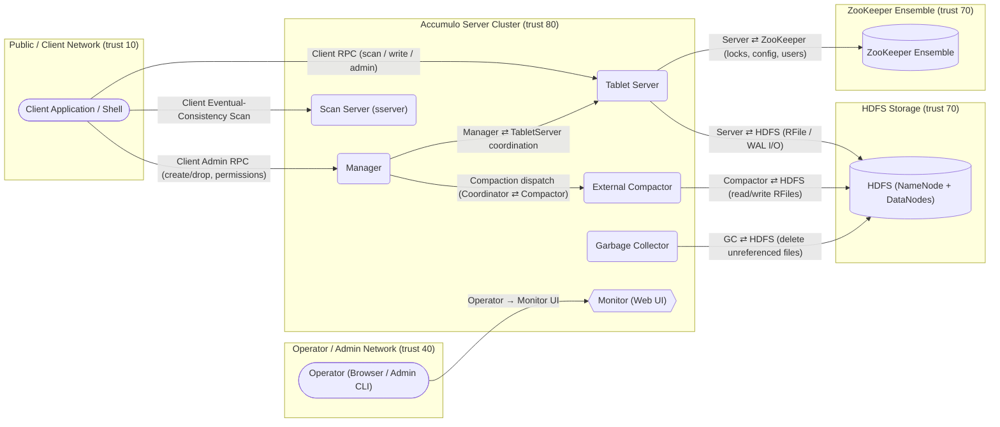
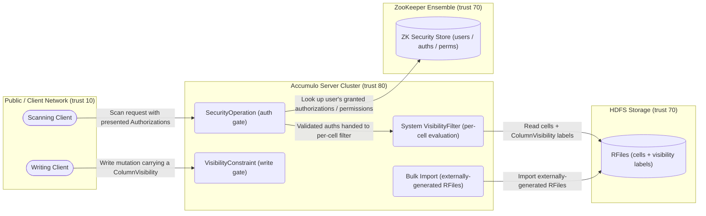

<!--
  GENERATED FILE — do not edit by hand.
  Regenerate with: python3 threat-model/gen-diagram.py
-->
# Threat Model Diagrams

Data-flow diagrams generated from the OTM models. Node shapes: stadium = external entity, rounded = process, cylinder = datastore, hexagon = web application. Subgraphs are trust zones.

## Apache Accumulo

Source: [`accumulo.otm.yaml`](accumulo.otm.yaml)

## Apache Accumulo — Column Visibility Subsystem

Source: [`column-visibility.otm.yaml`](column-visibility.otm.yaml)

